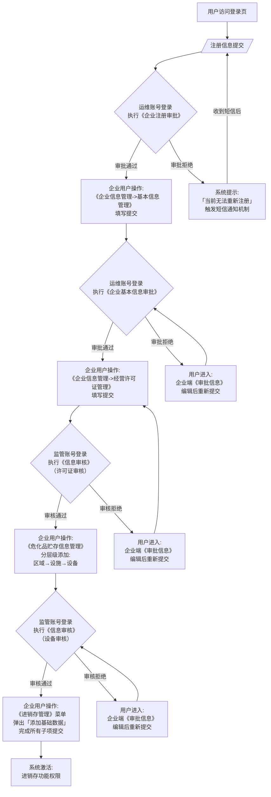

```mermaid
graph TD 
    A[用户访问登录页] --> B[/注册信息提交/]
    B --> C{运维账号登录<br>执行《企业注册审批》}
    C -->|审批通过| D[企业用户操作:<br>《企业信息管理->基本信息管理》<br>填写提交]
    C -->|审批拒绝| E[系统提示:<br>「当前无法重新注册」<br>触发短信通知机制]
    D --> F{运维账号登录<br>执行《企业基本信息审批》}
    F -->|审批通过| G[企业用户操作:<br>《企业信息管理->经营许可证管理》<br>填写提交]
    F -->|审批拒绝| H[用户进入:<br>企业端《审批信息》<br>编辑后重新提交]
    H --> F 
    G --> I{监管账号登录<br>执行《信息审核》<br>（许可证审核）}
    I -->|审核通过| J[企业用户操作:<br>《危化品贮存信息管理》<br>分层级添加:<br>区域→设施→设备]
    I -->|审核拒绝| K[用户进入:<br>企业端《审批信息》<br>编辑后重新提交]
    K --> G 
    J --> L{监管账号登录<br>执行《信息审核》<br>（设备审核）}
    L -->|审核通过| M[企业用户操作:<br>《进销存管理》菜单<br>弹出「添加基础数据」<br>完成所有子项提交]
    L -->|审核拒绝| N[用户进入:<br>企业端《审批信息》<br>编辑后重新提交]
    N --> L 
    M --> O[系统激活:<br>进销存功能权限]
    E -->|收到短信后| B
```